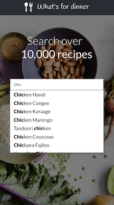

## Project description

A simple web application called 'What's for dinner' that allows users to search for dinner ideas.
The data is fetched from the api over at www.themealdb.com.
The results from the search are 'autocompleted'.

Bootstraped with Create React App

## To run the project:

### `npm install`
### `npm start`

Open [http://localhost:3000](http://localhost:3000) to view it in the browser.

